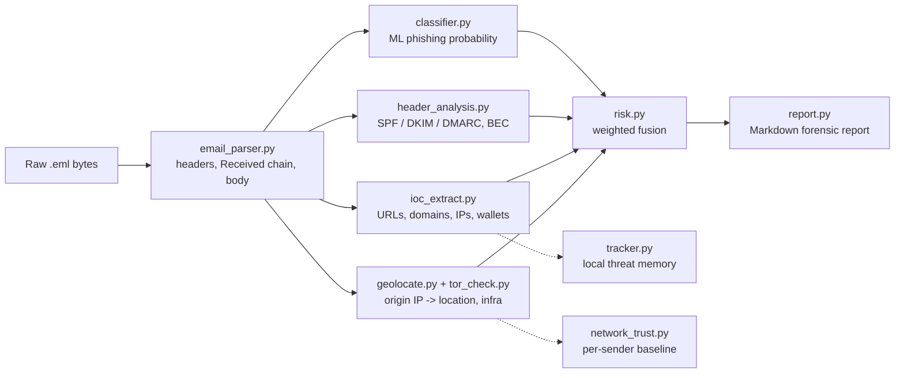

# 🛡️ Algorithmistic

**AI-Powered Email Threat Detection & Forensic Intelligence Platform**
*(formerly Smart India Hackathon project **SIH26106**)*


-6f42c1)


Algorithmistic is an offline-first email forensics and threat-intelligence
platform. Point it at a raw `.eml` file or a live IMAP mailbox and it will
parse the message, run it through an explainable ML phishing classifier,
verify SPF/DKIM/DMARC, extract and judge every URL/domain/IP, trace the
routing chain back toward its origin (flagging VPN/Tor/hosting
infrastructure along the way), correlate it against other cases, and
generate a court-ready Markdown report — all from one Streamlit dashboard.

Everything runs locally by default. The only outbound network calls are
optional: live IP geolocation (`ip-api.com`), the URLhaus threat feed,
Gmail OAuth/IMAP, and — if you choose to enable them — a **local** Ollama
instance for AI-written threat narratives and semantic origin correlation.

---

## Table of contents

- [Feature highlights](#feature-highlights)
- [How an email moves through the pipeline](#how-an-email-moves-through-the-pipeline)
- [Project structure](#project-structure)
- [Prerequisites](#prerequisites)
- [Installation](#installation)
- [Running the app](#running-the-app)
- [Using the dashboard](#using-the-dashboard)
- [Optional integrations](#optional-integrations)
- [Training / retraining the classifier](#training--retraining-the-classifier)
- [Data, storage & privacy](#data-storage--privacy)
- [Known limitations](#known-limitations)
- [⚠️ Before you push this to a public repo](#️-before-you-push-this-to-a-public-repo)
- [Contributing](#contributing)
- [License](#license)
- [Acknowledgements](#acknowledgements)

---

## Feature highlights

**Acquisition**
- 📁 **Evidence file upload** — single `.eml`/`.txt` files, or a bulk `.csv` manifest of cases
- ⚡ **Live IMAP mailbox interceptor** — read-only connection to Gmail, Yahoo, Outlook/Microsoft 365, or any custom IMAP server, over an app password, an OAuth2 access token, or one-click **Sign in with Google**

**Detection**
- **Explainable ML classifier** — TF‑IDF (1–2 grams) + Logistic Regression, exposing the exact terms that pushed a message toward "phishing"
- **SPF / DKIM / DMARC verification** — reads the receiving server's own authentication verdicts rather than re-querying DNS after the fact
- **BEC (Business Email Compromise) heuristics** — payment pressure, urgency language, executive-identity claims, free-mail senders, and the absence of any link/attachment to scan
- **IOC extraction** — URLs, domains, IPs, email addresses and crypto wallets, with look-alike/typosquat/homoglyph brand detection (`paypa1-support.com`, `micros0ft-securelogin.ru`, …) that needs no DNS or WHOIS lookup
- **Attachment scanning** — real-time ClamAV (`clamd`) in-memory scanning, with a risky-extension heuristic as a fallback

**Origin & routing**
- **Received-chain reconstruction** — walks the header chain oldest-first to find the true origin hop
- **Geolocation** — live IP‑API lookups with an offline cache fallback, classifying infrastructure as Tor / VPN / proxy / hosting / residential / corporate
- **Confirmed Tor exit-node detection** — cross-referenced against published exit-node directories, independent of the ISP-name heuristic
- **Per-sender network-trust baseline** — flags when *today's* message breaks a sender's established sending pattern (new network, new anonymising infrastructure, new country) instead of just flagging "uses a VPN," which is often normal for a given sender
- **Optional offline VPN/datacenter CIDR check** — built from X4BNet's public lists, for environments without live internet access

**AI & correlation (local-first)**
- 🤖 **AI Copilot** — per-email threat narrative generated by a local Qwen model via Ollama
- 🧠 **Nomic AI origin correlation** — embeds each message's origin/routing profile with `nomic-embed-text` (via Ollama) to surface cases that *behave* alike even when no literal indicator overlaps
- 🕸️ **Correlation graph** — a NetworkX graph linking senders, domains, IPs and wallets to surface multi-message campaigns

**Intelligence & memory**
- **Local adaptive threat memory** (SQLite) — every indicator seen is remembered and reused across future analyses
- **URLhaus live sync** — real-time Auth-Key API with an automatic CSV fallback, throttled to a 30‑minute window
- **Analyst feedback loop** — verified analyst labels are stored separately from raw indicators, ready to feed back into retraining

**Reporting**
- **Court-ready Markdown reports** — full scoring breakdown, header evidence, routing chain, IOCs, model explanation, recommended response actions, and an explicit limitations/legal section, anchored by a SHA‑256 hash of the original evidence file

---

## How an email moves through the pipeline



`analyzer.py` is the single entry point that runs this whole pipeline for
one email and returns one unified result dict — the same function powers
both the interactive dashboard and the `analyze_all_samples()` batch/CLI
path, so nothing about the engine depends on Streamlit.

## Project structure

| File | Role |
| --- | --- |
| `app.py` | Streamlit dashboard — navigation, dual acquisition modes, workflow tabs, AI copilot chat, live status widgets |
| `analyzer.py` | Pipeline orchestrator — runs every module over one email |
| `email_parser.py` | RFC 5322 parser, Received-chain walker |
| `classifier.py` | TF‑IDF + Logistic Regression phishing model (`load_or_train`, `predict`) |
| `header_analysis.py` | SPF/DKIM/DMARC verdicts, spoofing anomalies, BEC heuristic |
| `ioc_extract.py` | URL/domain/IP/wallet extraction, look-alike brand detection |
| `geolocate.py` | IP → location/infrastructure (live API + offline cache) |
| `tor_check.py` | Published Tor exit-node list lookups, throttled auto-refresh |
| `network_trust.py` | Per-sender network-history baseline + anomaly flags; optional offline VPN/datacenter CIDR check |
| `risk.py` | Weighted fusion of six signals into one explainable 0–100 score |
| `report.py` | Markdown forensic report generator, SHA‑256 evidence hash |
| `correlate.py` | NetworkX campaign-correlation graph |
| `nomic_embed.py` | Semantic origin-similarity search (local `nomic-embed-text` via Ollama) |
| `ollama_threat.py` | Per-email AI threat narrative (local Qwen model via Ollama) |
| `antivirus_scan.py` | Real-time ClamAV (`clamd`) in-memory attachment scanning |
| `live_scanner.py` | Read-only IMAP browsing/fetching — Gmail, Yahoo, Outlook/365, custom |
| `google_Oauth.py` | Google OAuth2 (PKCE) sign-in for Gmail IMAP (XOAUTH2) |
| `threat_feed.py` | URLhaus real-time API + CSV sync into local threat intel |
| `fetch_vpn_ranges.py` | Optional script to build an offline VPN/datacenter CIDR list (X4BNet) |
| `tracker.py` | Local SQLite "threat memory" — indicator reputation, analyst feedback, retraining samples |
| `gen_data.py` | Synthetic, seeded, labelled training-corpus generator |
| `config.py` | Central config — paths, brand lists, scoring weights, verdict thresholds |
| `requirements.txt` | Python dependencies |
| `data/` | Created at runtime — `emails.csv`, `model.joblib`, `geo_cache.json`, `vpn_ranges.csv` (optional), `urlhaus_last_update.txt` |
| `samples/` | Demo `.eml` files for offline testing (optional) |
| `threat_memory.db` | SQLite database created on first run |

---

## Prerequisites

- **Python 3.10+**
- **pip** and **git**
- *(optional)* [Ollama](https://ollama.com) running locally, with a Qwen model
  (whichever `ollama_threat.py` is configured for) and `nomic-embed-text`
  pulled — needed for **AI Copilot** and **Nomic AI**
- *(optional)* A **ClamAV** `clamd` daemon running locally — needed for the
  **Antivirus** panel
- *(optional)* A **Google Cloud OAuth 2.0 client** — needed for one-click
  **Sign in with Google** on the Live IMAP mailbox interceptor
- *(optional)* A free **URLhaus Auth-Key** from [auth.abuse.ch](https://auth.abuse.ch/) — needed for the real-time threat-intel sync (a CSV fallback works with no key)

None of the optional items block the app from running — every one of them
fails soft and the relevant panel simply explains what's missing.

## Installation

### 1. Clone the repository

```bash
git clone https://github.com/heydrsubha-del/SMART-INDIA-HACKATHON-PROJECT-26106.git
cd SMART-INDIA-HACKATHON-PROJECT-26106
```

### 2. Create and activate a virtual environment

**Windows (PowerShell)**
```powershell
python -m venv .venv
.venv\Scripts\Activate.ps1
# If PowerShell blocks the script:
Set-ExecutionPolicy -Scope Process -ExecutionPolicy Bypass
.venv\Scripts\Activate.ps1
```

**Windows (cmd.exe)**
```cmd
python -m venv .venv
.venv\Scripts\activate.bat
```

**macOS / Linux**
```bash
python3 -m venv .venv
source .venv/bin/activate
```

### 3. Install dependencies

```bash
python -m pip install --upgrade pip
pip install -r requirements.txt
```

That's it for the core app — `folium`, `streamlit-folium`, the Google
OAuth libraries and everything else are already pinned in
`requirements.txt`.

## Running the app

```bash
streamlit run app.py
```

Streamlit will start a local server and open your browser to
`http://localhost:8501`. On first launch the app will transparently
generate its training data and model, and its local SQLite database — see
[Training / retraining the classifier](#training--retraining-the-classifier)
below.

## Using the dashboard

**1. Pick an acquisition mode** on the Dashboard:
   - **Live IMAP mailbox interceptor** — choose a provider, enter the IMAP
     server/port, and sign in (app password, OAuth2 token, or Google
     sign-in). The scanner is strictly **read-only** — it never marks mail
     as read or deletes/moves anything.
   - **Evidence file upload** — drop in a `.eml`, `.txt`, or a `.csv`
     manifest for a bulk batch.

**2. Walk the workflow tabs** for any analyzed case:
   `Dashboard → AI threat analysis → Forensic report → Classification →
   Headers & auth → Origin & route → Indicators` — plus correlation,
   threat history, the URLhaus feed, antivirus, settings and about.

**3. Use the sidebar** to jump straight to any module:

| Group | Contains |
| --- | --- |
| Threat Operations | Upload Email(s), Live Email Scan (IMAP), AI Copilot, Nomic AI |
| Visualization | Global Threat Map, Correlation Graph, Analytics |
| Intelligence | Threat History, IOC Lookup, URLhaus Feed |
| Security | Antivirus (ClamAV) |
| System | Settings, About |

**4. Export a report.** Every analyzed case can be exported as a
Markdown forensic report, complete with a SHA‑256 hash of the source file
so a reviewer can confirm the exhibit hasn't been altered.

## Optional integrations

<details>
<summary><b>Ollama — AI Copilot & Nomic AI</b></summary>

```bash
# Install Ollama from https://ollama.com, then:
ollama pull nomic-embed-text
ollama pull <the Qwen model configured in ollama_threat.py>
ollama serve        # if it isn't already running as a service
```

Both features fail soft — if Ollama isn't reachable, the relevant panel
explains that instead of crashing the app.
</details>

<details>
<summary><b>ClamAV — attachment scanning</b></summary>

Install and run `clamd` locally (via your OS package manager, or Docker).
By default the app looks for it at `127.0.0.1:3310`; override with:

```bash
export SIH26106_CLAMD_HOST=127.0.0.1
export SIH26106_CLAMD_PORT=3310
```

If `clamd` isn't reachable, attachment risk falls back to the built-in
risky-extension heuristic.
</details>

<details>
<summary><b>Google OAuth — one-click Gmail sign-in</b></summary>

1. In [Google Cloud Console](https://console.cloud.google.com/), create an
   OAuth 2.0 Client ID (Desktop or Web application type both work).
2. Download the client JSON and save it as `client_secret.json` in the
   project root (or point `SIH26106_GOOGLE_CLIENT_SECRETS` at another
   path).
3. If the app isn't running at `http://localhost:8501`, register your
   actual URL as an authorized redirect URI and set
   `SIH26106_GOOGLE_REDIRECT_URI` to match.
4. Install `google-auth` and `google-auth-oauthlib` (already in
   `requirements.txt`).

The user's Google password is never collected by the app — only a scoped
OAuth token is stored locally in `.sih26106_google_token.json`.
</details>

<details>
<summary><b>URLhaus — live malicious-URL feed</b></summary>

Get a free Auth-Key from [auth.abuse.ch](https://auth.abuse.ch/) and set it
as an environment variable:

```bash
export URLHAUS_AUTH_KEY=your-own-key-here
```

Without a key, the app automatically falls back to URLhaus's public bulk
CSV feed (no key required, just a lower refresh cadence).
</details>

<details>
<summary><b>Offline VPN/datacenter ranges</b></summary>

For environments without live internet access, build a local CIDR
database from X4BNet's public lists:

```bash
python fetch_vpn_ranges.py --output data/vpn_ranges.csv
```

This requires outbound access to `raw.githubusercontent.com` at the time
you run it — run it anywhere with internet access and copy the resulting
CSV into `data/` on the machine that runs the app.
</details>

## Training / retraining the classifier

`classifier.load_or_train()` loads an existing model from
`data/model.joblib` if one exists, or otherwise trains a fresh one
automatically the first time it's needed — you shouldn't need to run
anything by hand for a normal first launch.

To generate (or inspect) the labelled training corpus directly:

```bash
python gen_data.py
```

This writes a seeded, balanced, synthetic dataset to `data/emails.csv` —
identical on every machine, deliberately including **hard negatives**
(genuine business email that legitimately uses phishing vocabulary like
"invoice," "urgent," or "verify") so the model learns context instead of
keyword-matching.

To force a clean retrain (e.g. after editing `config.py`'s brand lists or
scoring weights), delete `data/emails.csv` and `data/model.joblib` and
restart the app.

Verified analyst feedback captured through the dashboard is stored
separately in `threat_memory.db` (`feedback`, `feedback_samples`,
`feedback_history` tables), ready to be folded into a future retrain.

### How the risk score is built

Six signals are combined as a plain weighted average — every point on the
final 0–100 score is traceable to a named reason:

| Signal | Weight |
| --- | --- |
| ML phishing-language model | 38 |
| Business Email Compromise pattern | 18 |
| SPF / DKIM / DMARC authentication | 15 |
| Header & identity anomalies | 12 |
| Malicious link indicators | 12 |
| Origin infrastructure reputation | 5 |

| Score | Verdict |
| --- | --- |
| ≥ 75 | Critical |
| ≥ 55 | High |
| ≥ 30 | Medium |
| < 30 | Low |

## Data, storage & privacy

- Everything is stored **locally** in `threat_memory.db` (SQLite) and the
  `data/` folder — nothing is uploaded anywhere by default.
- Outbound calls only happen for the features you enable: live
  geolocation (`ip-api.com`), the URLhaus feed, Gmail IMAP/OAuth, and any
  local Ollama requests (which never leave your machine).
- IMAP access is **strictly read-only** — no message is ever marked read,
  moved, or deleted.
- Generated forensic reports contain personal data (sender identities,
  routing information). Handle them under your organisation's data-
  protection policy (the report template itself flags this, referencing
  India's DPDP Act 2023) and restrict access to authorised investigators.

## Known limitations

These are stated plainly in every generated report, and worth knowing up
front:

- **Geolocation is approximate** — city/country level at best, and can be
  wrong for VPN, proxy, Tor and cloud ranges. Treat it as an investigative
  lead, not proof of physical location.
- **Headers can be forged** below the first hop added by a trusted mail
  server.
- **The ML score is probabilistic** — a decision aid, not a sole basis for
  blocking or accusing anyone.
- **Attribution is not identification** — shared infrastructure links
  messages to a campaign; naming a person requires records obtained
  through lawful process.
- **The Tor exit-node check is a point-in-time snapshot** of the published
  exit list at analysis time, not necessarily at send time.

## ⚠️ Before you push this to a public repo

`threat_feed.py` ships with a **hardcoded fallback URLhaus Auth-Key** for
zero-setup convenience during development. Its own docstring already says
it plainly: **treat that key as compromised the moment this repo goes
public**, and generate a fresh one at
[auth.abuse.ch](https://auth.abuse.ch/). Set your real key via the
`URLHAUS_AUTH_KEY` environment variable (see
[Optional integrations](#optional-integrations)) rather than editing the
hardcoded value in the source.

It's also worth adding a `.gitignore` before your first push, so local
secrets and generated artifacts never get committed:

```gitignore
.venv/
__pycache__/
*.pyc
data/
threat_memory.db
client_secret.json
.sih26106_google_token.json
```

## Contributing

Issues and pull requests are welcome. If you're proposing a change to the
scoring weights, brand lists, or detection heuristics in `config.py`,
please include the reasoning (and ideally a sample email) that motivated
it — every number in this project is meant to be traceable to a reason,
not tuned blind.

## License

This repository does not yet declare a license. If you intend for others
to reuse, modify or redistribute this code, add a `LICENSE` file (MIT and
Apache‑2.0 are common, permissive choices) before publishing — without
one, visitors have no legal right to reuse the code even though it's
public.

## Acknowledgements

- [abuse.ch URLhaus](https://urlhaus.abuse.ch/) — malicious URL feed
- [X4BNet](https://github.com/X4BNet/lists_vpn) — public VPN/datacenter IP ranges
- [ip-api.com](https://ip-api.com/) — IP geolocation
- [ClamAV](https://www.clamav.net/) — open-source antivirus engine
- [Ollama](https://ollama.com/) — local model runtime powering the AI Copilot and Nomic AI features