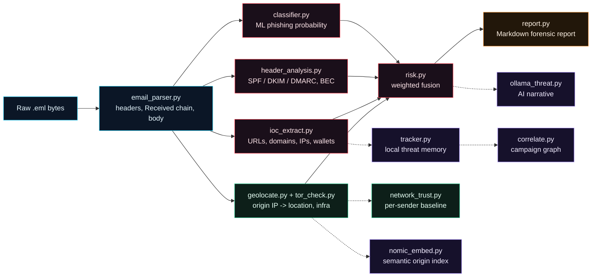

<!-- ═══════════════════════════ HEADER ═══════════════════════════ -->
<div align="center">


<br/>


<br/><br/>


<br/>


<br/><br/>

<b>
<a href="#-feature-highlights">Features</a> •
<a href="#-how-an-email-moves-through-the-pipeline">Pipeline</a> •
<a href="#-installation">Install</a> •
<a href="#-using-the-dashboard">Usage</a> •
<a href="#-synapse-copilot">Copilot</a> •
<a href="#-configuration-reference">Config</a> •
<a href="#-security--secrets">Security</a> •
<a href="#-license">License</a>
</b>

<br/><br/>

<i>Formerly Smart India Hackathon project <b>SIH26106</b></i>

</div>

<!-- ═══════════════════════════ AT A GLANCE ═══════════════════════════ -->

<div align="center">

| 🎯 **6-signal** explainable risk score | 🔐 **3** password-free OAuth providers | 📜 **4** report export types | 🛰️ **3** Tor exit-list sources | 🧠 **100%** local AI by default |
|:---:|:---:|:---:|:---:|:---:|

</div>

---

## 🛡️ About

Algorithmistic is an offline-first email forensics and threat-intelligence
platform. Point it at a raw `.eml` file, a bulk `.csv` export, or a live IMAP
mailbox and it will parse the message, run it through an explainable ML
phishing classifier, verify SPF/DKIM/DMARC, extract and judge every
URL/domain/IP, trace the routing chain back toward its origin (flagging
VPN/Tor/hosting infrastructure along the way), correlate it against other
cases, and generate a court-ready Markdown report, all from one dark-themed
SOC-style Streamlit dashboard.

Everything runs locally by default. The only outbound network calls are
optional: live IP geolocation (`ip-api.com`), the URLhaus threat feed, Tor
exit-node and X4BNet VPN/datacenter list refreshes, Gmail / Microsoft / Yandex
OAuth and IMAP, the optional VirusTotal and Cohere cloud fallbacks, and (if
you choose to enable it) a **local** Ollama instance for AI-written threat
narratives and semantic origin correlation.

---

## 📑 Table of contents

- [Feature highlights](#-feature-highlights)
- [How an email moves through the pipeline](#-how-an-email-moves-through-the-pipeline)
- [Project structure](#-project-structure)
- [Prerequisites](#-prerequisites)
- [Installation](#-installation)
- [Running the app](#-running-the-app)
- [Using the dashboard](#-using-the-dashboard)
- [Synapse Copilot](#-synapse-copilot)
- [Optional integrations](#-optional-integrations)
- [Configuration reference](#-configuration-reference)
- [Training / retraining the classifier](#-training--retraining-the-classifier)
- [Data, storage & privacy](#-data-storage--privacy)
- [Built-in limits](#-built-in-limits)
- [Known limitations](#-known-limitations)
- [Troubleshooting](#-troubleshooting)
- [Security & secrets](#-security--secrets)
- [Contributing](#-contributing)
- [License](#-license)
- [Acknowledgements](#-acknowledgements)

---

## ✨ Feature highlights

### 

- 📁 **Evidence file upload (Channel B · Batch)**: single `.eml`/`.txt` files, or a bulk `.csv` manifest of cases, up to **50 MB per file**. CSV columns are detected by intelligent field mapping, so the CSV doesn't need one fixed schema.
- ⚡ **Live IMAP mailbox interceptor (Channel A · Live)**: a read-only connection over IMAP-over-SSL (port 993) to Gmail, Yahoo, Outlook/Microsoft 365, Yandex, or any custom IMAP server. You can connect with an app password, an OAuth2 access token, or one-click **Sign in with Google / Outlook / Yandex**.
- 🔐 **Password-free OAuth**: with Google, Microsoft and Yandex sign-in, your password never passes through the app. Sign-in can finish in a popup or new tab, and the code is handed back to the main tab through a secure relay (`BroadcastChannel`). The signed-in address is cached so it doesn't need retyping after a restart.
- 🚀 **Instant message opening**: the newest 15 message bodies are prefetched in one background IMAP session and held in a per-session cache, so opening a message is close to instant. The inbox view shows sender avatars, subject tags (Security, Account, Billing…) and relative timestamps.

### 

- **Explainable ML classifier**: TF‑IDF (1–2 grams) + Logistic Regression, exposing the exact terms that pushed a message toward "phishing"
- **SPF / DKIM / DMARC verification**: reads the receiving server's own authentication verdicts rather than re-querying DNS after the fact
- **BEC (Business Email Compromise) heuristics**: payment pressure, urgency language, executive-identity claims, free-mail senders, and the absence of any link/attachment to scan
- **IOC extraction**: URLs, domains, IPs, email addresses and crypto wallets, with look-alike/typosquat/homoglyph brand detection (`paypa1-support.com`, `micros0ft-securelogin.ru`, …) that needs no DNS or WHOIS lookup
- **Attachment scanning**: real-time ClamAV (`clamd`) in-memory scanning (`zINSTREAM`), an optional VirusTotal multi-engine cloud fallback, and a risky-extension heuristic as the last resort

### 

- **Received-chain reconstruction**: walks the header chain oldest-first, skipping private/loopback/reserved addresses, to find the true origin hop, and separates trusted hops from possibly forged ones
- **Geolocation**: live IP‑API lookups with an offline cache fallback, plus an optional local MaxMind GeoLite2 database, classifying infrastructure as Tor / VPN / proxy / hosting / residential / corporate
- **Interactive hop map**: a Folium satellite map (Esri World Imagery) with numbered, risk-coloured hop pins (Critical red, High orange, Medium yellow, Low blue). It has "All emails" mode (up to 10 recent emails) and "Single email" mode, and when several emails come from the same location they share one stacked pin labelled with their email numbers.
- **Confirmed Tor exit-node detection**: cross-referenced against three published sources (the official Tor Project exit list, a community exit-node mirror, and the full Tor node list), independent of the ISP-name heuristic. Lists auto-refresh every 30 minutes, with a manual "Fetch Tor lists now" button.
- **Per-sender network-trust baseline**: flags when *today's* message breaks a sender's established sending pattern (new network, new anonymising infrastructure, new country) instead of just flagging "uses a VPN," which is often normal for a given sender. *VPN masking* (was this message anonymised?) and *network trust* (is that normal for this sender?) are reported as two separate signals.
- **Bulk infrastructure scan**: scans every origin and hop IP across all loaded cases in one pass, either against X4BNet VPN/datacenter CIDR ranges (fetched live in the UI, or loaded from a local CSV for air-gapped use) or against the cached Tor exit lists
- **Optional offline VPN/datacenter CIDR check**: built from X4BNet's public lists, for environments without live internet access

### 

- 🤖 **AI Threat Analysis**: per-email and multi-email campaign threat narratives (up to 20 recent emails in campaign mode), generated by a local Qwen model via Ollama and limited to the evidence in front of it
- 💬 **Synapse Copilot**: an always-available chat assistant (Qwen + Nomic AI) that runs forensic workflows from plain-English commands. See [Synapse Copilot](#-synapse-copilot).
- 🧠 **Nomic AI origin correlation**: embeds each message's origin/routing profile (geography, infrastructure class, relay path of up to 8 hops, network operator) with `nomic-embed-text` (via Ollama, with an optional Cohere cloud fallback) to surface cases that *behave* alike even when no literal indicator overlaps. Matches are ranked by cosine similarity plus a shared-trait bonus and grouped into **Strong ≥ 85%**, **Related ≥ 70%** and **Weak ≥ 55%** (anything lower is treated as noise).
- 🕸️ **Correlation graph**: a NetworkX graph linking senders, domains, IPs and wallets to surface multi-message campaigns. Solid edges are hard evidence and dashed edges are AI-inferred semantic links (opt-in). Click a node to highlight what it connects to. Large graphs are sampled for readability with a reproducible layout seed, and the result is cached so it doesn't re-render on every interaction.

### 

- **Local adaptive threat memory** (SQLite): every indicator seen is remembered and reused across future analyses, with repeat-offender alerts for IPs seen before
- **URLhaus live sync**: real-time Auth-Key API with an automatic CSV fallback, throttled to a 30‑minute window, plus a manual "Sync URLHaus Feed Now" button
- **Threat history**: total logged, Critical/High count, average score, and the last 200 logged messages with timestamp, IP, country, score and verdict
- **Analyst feedback loop**: "Confirm Threat" / "False Positive" verdicts are stored separately from raw indicators. Once **20 verified samples** are collected, an adaptive model is retrained, and it only replaces the base model if validation accuracy improves.

### 

- **Court-ready Markdown reports**: full scoring breakdown, header evidence, routing chain, IOCs, model explanation, recommended response actions, and an explicit limitations/legal section, anchored by a SHA‑256 hash of the original evidence file
- **Four export types**: *AI Result Only*, *Machine Result Only*, *Combined Report*, and a batch *Joint Report*, which covers all emails in a pipeline run as one `.md` file

<p align="right"><a href="#top">⬆ back to top</a></p>

---

## 🔄 How an email moves through the pipeline


```mermaid
flowchart LR
    A[Raw .eml bytes] --> B[email_parser.py\nheaders, Received chain, body]
    B --> C[classifier.py\nML phishing probability]
    B --> D[header_analysis.py\nSPF / DKIM / DMARC, BEC]
    B --> E[ioc_extract.py\nURLs, domains, IPs, wallets]
    B --> F[geolocate.py + tor_check.py\norigin IP -> location, infra]
    C --> G[risk.py\nweighted fusion]
    D --> G
    E --> G
    F --> G
    G --> H[report.py\nMarkdown forensic report]
    E -.-> I[tracker.py\nlocal threat memory]
    F -.-> J[network_trust.py\nper-sender baseline]
    G -.-> K[ollama_threat.py\nAI narrative]
    F -.-> L[nomic_embed.py\nsemantic origin index]
    I -.-> M[correlate.py\ncampaign graph]

    classDef input fill:#0b1626,stroke:#2fd8ff,color:#e6f7ff;
    classDef detect fill:#1a0f1a,stroke:#ff4757,color:#ffe6ea;
    classDef origin fill:#0d1f19,stroke:#35d399,color:#e6fff4;
    classDef ai fill:#16112b,stroke:#a389f4,color:#f0ebff;
    classDef out fill:#22170a,stroke:#ff9f43,color:#fff3e6;
    class A,B input;
    class C,D,E,G detect;
    class F,J origin;
    class K,L,M,I ai;
    class H out;
```

`analyzer.py` is the single entry point that runs this whole pipeline for
one email and returns one unified result dict. The same function powers
both the interactive dashboard and the `analyze_all_samples()` batch/CLI
path, so nothing about the engine depends on Streamlit.

The dashboard's **batch pipeline** (started from "Analyze N Recent Emails",
the "Full Report" quick action, or a Copilot command) runs three stages over
a set of emails: machine analysis of every message, then a local AI
campaign assessment, then semantic-origin indexing for correlation. Live
IMAP messages that have already been prefetched also get a lightweight,
machine-only analysis automatically, so the Origin & Route map and the
Correlation graph can show every browsed message without waiting on the
slower LLM stages.

---

## 🗂️ Project structure

| File | Role |
| --- | --- |
| `app.py` | Streamlit dashboard: navigation, dual acquisition modes, workflow tabs, Synapse Copilot chat, live status widgets |
| `analyzer.py` | Pipeline orchestrator: runs every module over one email |
| `email_parser.py` | RFC 5322 parser, Received-chain walker |
| `classifier.py` | TF‑IDF + Logistic Regression phishing model (`load_or_train`, `predict`, adaptive retraining from feedback) |
| `header_analysis.py` | SPF/DKIM/DMARC verdicts, spoofing anomalies, BEC heuristic |
| `ioc_extract.py` | URL/domain/IP/wallet extraction, look-alike brand detection |
| `geolocate.py` | IP → location/infrastructure (live API + offline cache, optional GeoLite2) |
| `tor_check.py` | Published Tor exit-node list lookups, throttled auto-refresh |
| `network_trust.py` | Per-sender network-history baseline + anomaly flags; optional offline VPN/datacenter CIDR check |
| `risk.py` | Weighted fusion of six signals into one explainable 0–100 score |
| `report.py` | Markdown forensic report generator, SHA‑256 evidence hash |
| `correlate.py` | NetworkX campaign-correlation graph (sampling, seeded layout, semantic edges, node highlight) |
| `nomic_embed.py` | Semantic origin-similarity search (local `nomic-embed-text` via Ollama, optional Cohere fallback) |
| `ollama_threat.py` | Per-email and batch AI threat narratives (local Qwen model via Ollama) |
| `antivirus_scan.py` | Real-time ClamAV (`clamd`) in-memory attachment scanning, VirusTotal fallback |
| `live_scanner.py` | Read-only IMAP browsing/fetching (Gmail, Yahoo, Outlook/365, Yandex, custom) |
| `google_Oauth.py` | Google OAuth2 (PKCE) sign-in for Gmail IMAP (XOAUTH2) |
| `microsoft_oauth.py` | Microsoft / Outlook / Microsoft 365 OAuth2 sign-in for IMAP |
| `yandex_oauth.py` | Yandex OAuth2 sign-in for IMAP (`yandex_Oauth.py` is also accepted) |
| `threat_feed.py` | URLhaus real-time API + CSV sync into local threat intel |
| `fetch_vpn_ranges.py` | Optional script to build an offline VPN/datacenter CIDR list (X4BNet), also used for live fetches in the UI |
| `tracker.py` | Local SQLite "threat memory": indicator reputation, analyst feedback, retraining samples, multi-user isolation, `delete_my_data` |
| `gen_data.py` | Synthetic, seeded, labelled training-corpus generator |
| `config.py` | Central config: paths, brand lists, scoring weights, verdict thresholds |
| `requirements.txt` | Python dependencies |
| `client_secret.example.json` | Template for your own Google OAuth client file (copy to `client_secret.json`) |
| `.streamlit/config.toml` | Streamlit theme/server settings |
| `LICENSE` | MIT License text |
| `data/` | Created at runtime: `emails.csv`, `model.joblib`, `geo_cache.json`, `vpn_ranges.csv` (optional), `GeoLite2-City.mmdb` (optional), `urlhaus_last_update.txt` |
| `samples/` | Demo `.eml` files and sample threat CSVs for offline testing (fictional addresses only) |
| `threat_memory.db` | SQLite database created on first run (local only, gitignored) |

> [!NOTE]
> The **About** page inside the app displays this `README.md`, so keep it
> next to `app.py`.

---

## 🧰 Prerequisites

- **Python 3.10+**
- **pip** and **git**
- *(optional)* [Ollama](https://ollama.com) running locally, with a Qwen model
  (whichever `ollama_threat.py` is configured for) and `nomic-embed-text`
  pulled. Needed for **AI Threat Analysis**, **Synapse Copilot** and **Nomic AI**.
- *(optional)* A **ClamAV** `clamd` daemon running locally, needed for the
  **Antivirus** panel (or a VirusTotal API key as a cloud fallback)
- *(optional)* A **Google Cloud OAuth 2.0 client**, needed for one-click
  **Sign in with Google** on the Live IMAP mailbox interceptor
- *(optional)* A **Microsoft** and/or **Yandex** OAuth app registration, needed
  for **Sign in with Outlook / Yandex** (configured in `microsoft_oauth.py` /
  `yandex_oauth.py`)
- *(optional)* A free **URLhaus Auth-Key** from [auth.abuse.ch](https://auth.abuse.ch/), needed for the real-time threat-intel sync (a CSV fallback works with no key)
- *(optional)* `python-docx`, used for DOCX support if installed (the app detects it automatically)

> [!TIP]
> None of the optional items block the app from running. Each one fails
> soft, and the relevant panel explains what's missing.

---

## 📦 Installation

### 1. Clone the repository

```bash
git clone https://github.com/heydrsubha-del/SMART-INDIA-HACKATHON-PROJECT-26106.git
cd SMART-INDIA-HACKATHON-PROJECT-26106
```

### 2. Create and activate a virtual environment

**Windows (PowerShell)**
```powershell
python -m venv .venv
.venv\Scripts\Activate.ps1
# If PowerShell blocks the script:
Set-ExecutionPolicy -Scope Process -ExecutionPolicy Bypass
.venv\Scripts\Activate.ps1
```

**Windows (cmd.exe)**
```cmd
python -m venv .venv
.venv\Scripts\activate.bat
```

**macOS / Linux**
```bash
python3 -m venv .venv
source .venv/bin/activate
```

### 3. Install dependencies

```bash
python -m pip install --upgrade pip
pip install -r requirements.txt
```

That's all the core app needs. `folium`, `streamlit-folium`, the Google
OAuth libraries and everything else are already pinned in
`requirements.txt`.

### 4. (Optional) Add your own credentials

The repository ships **no keys, tokens or personal data**. Every user
brings their own. The core app runs without any of this, so only add what
you need:

| Feature | What you provide | How |
| --- | --- | --- |
| Sign in with Google | Your own OAuth client | Copy `client_secret.example.json` to `client_secret.json` and fill in your values (see [Google OAuth](#-optional-integrations)) |
| Sign in with Outlook / Yandex | Your own app registration | Configure `microsoft_oauth.py` / `yandex_oauth.py` with your client details |
| Real-time URLhaus sync | Your own free Auth-Key | Set the `URLHAUS_AUTH_KEY` environment variable |
| VirusTotal fallback | Your own API key | Set `SIH26106_VT_API_KEY` |
| Cohere embedding fallback | Your own API key | Set `SIH26106_COHERE_API_KEY` |
| Gmail / IMAP via app password | Your own app password | Typed into the dashboard at runtime, never stored in the code |

`client_secret.json`, your OAuth token files, the email-cache files and
`.env` are all listed in `.gitignore`, so they stay on your machine.

---

## ▶️ Running the app

```bash
streamlit run app.py
```

Streamlit will start a local server and open your browser to
`http://localhost:8501`. On first launch the app will automatically
generate its training data, its model and its local SQLite database. See
[Training / retraining the classifier](#-training--retraining-the-classifier)
below.

---

## 🖥️ Using the dashboard

**1. Pick an acquisition mode** on the Dashboard:
   - **Channel A · Live: Live IMAP mailbox interceptor.** Connects straight
     to the mailbox and pulls messages in real time. Choose a provider (it is
     auto-detected from your email domain), enter the IMAP server/port, and
     sign in with an app password, an OAuth2 token, or Google / Outlook /
     Yandex sign-in. The scanner is strictly **read-only**: it never marks
     mail as read or deletes/moves anything.
   - **Channel B · Batch: Evidence file upload.** Analyses saved evidence
     offline, one message or a whole export. Drop in a `.eml`, `.txt`, or a
     `.csv` manifest for a bulk batch (up to 50 MB per file). CSV uploads
     support a Bulk Threat Scan with severity filtering (Critical / High /
     Medium / Low), a per-row Deep Dive, and "Analyze 10 Most Recent".

**2. Walk the workflow tabs** for any analyzed case:
   `Dashboard → AI threat analysis → Forensic report → Classification →
   Headers & auth → Origin & route → Indicators`, plus correlation,
   threat history, the URLhaus feed, antivirus, settings and about.

   Until evidence is loaded, only **Dashboard**, **Settings** and **About**
   are shown, so there are no dead links to empty panels. The full workflow
   appears as soon as a mailbox connects or a file is loaded.

**3. Use the sidebar** to jump straight to any module:

| Group | Contains |
| --- | --- |
| 🔴 Threat Operations | Upload Email(s), Live Email Scan (IMAP), AI Copilot, Nomic AI |
| 🔵 Visualization | Global Threat Map, Correlation Graph, Analytics |
| 🟣 Intelligence | Threat History, IOC Lookup, URLhaus Feed |
| 🟠 Security | Antivirus (ClamAV) |
| ⚪ System | Settings, About |

   Sidebar shortcuts map onto the workflow panels: *Nomic AI* and *Global
   Threat Map* open **Origin & Route**, *Analytics* opens **Classification**,
   and *IOC Lookup* opens **Indicators**.

**4. Review and give feedback.** At the bottom of the Dashboard, the
**Analyst Feedback** panel lets you mark a case as **Confirm Threat** or
**False Positive** after reviewing the full evidence. The **AI Learning
Status** shows progress toward the adaptive model (for example, `0 / 20
verified samples collected`).

**5. Export a report.** Every analyzed case can be exported as a Markdown
forensic report (*AI Result Only*, *Machine Result Only* or *Combined*), and
batch runs can be exported as a single *Joint Report*. Each report includes a
SHA‑256 hash of the source file so a reviewer can confirm the exhibit hasn't
been altered.

---

## 💬 Synapse Copilot

Synapse Copilot is the dashboard's built-in assistant, powered by the local
Qwen model plus Nomic AI. It knows whether you are in Live IMAP or
file-upload mode, and it will ask you to connect a mailbox or upload a CSV
if the data it needs isn't loaded. It has quick-action chips for common tasks
and accepts typed commands such as:

| Example command | What it does |
| --- | --- |
| `Track my last 10 emails` | Fetches and scans the N most recent emails (live mailbox or loaded CSV), runs the full machine + AI + semantic pipeline, and produces a downloadable forensic report |
| `Show threats from last week` | Lists the last 7 days of local threat history with verdict, score, IP and country |
| `Search similar with Nomic AI` | Runs a semantic similarity search for origins and infrastructure like the current evidence |
| *(evidence questions)* | Summarises the currently loaded evidence, including risk level and threat score |

The chat shows the most recent messages, and a pulse indicator shows when
the Copilot is ready.

---

## 🔌 Optional integrations

<details>
<summary><b>🤖 Ollama: AI Threat Analysis, Synapse Copilot & Nomic AI</b></summary>

```bash
# Install Ollama from https://ollama.com, then:
ollama pull nomic-embed-text
ollama pull <the Qwen model configured in ollama_threat.py>
ollama serve        # if it isn't already running as a service
```

These features fail soft. If Ollama isn't reachable, the relevant panel
says so instead of crashing the app.

For semantic correlation without a local Ollama, set
`SIH26106_COHERE_API_KEY` to use Cohere embeddings as a cloud fallback.
</details>

<details>
<summary><b>🦠 ClamAV: attachment scanning (with VirusTotal fallback)</b></summary>

Install and run `clamd` locally (via your OS package manager, or Docker).
By default the app looks for it at `127.0.0.1:3310`. To override that:

```bash
export SIH26106_CLAMD_HOST=127.0.0.1
export SIH26106_CLAMD_PORT=3310
```

Attachments are streamed to `clamd` in memory for a real signature scan.
The Antivirus panel shows the connected `clamd` version and, for every
attachment, its case, filename, size, status (`INFECTED`, `Clean`,
`Scan error`, `Risky extension`) and the detected signature.

If `clamd` isn't reachable, the app falls back in two steps:

1. **VirusTotal (cloud):** if `SIH26106_VT_API_KEY` is set, each attachment
   is hashed and checked against VirusTotal's multi-engine service.
2. **Heuristic:** if neither is available, attachment risk falls back to
   the built-in risky-extension heuristic.
</details>

<details>
<summary><b>🟦 Google OAuth: one-click Gmail sign-in</b></summary>

Every user creates their **own** Google OAuth client. No shared or
project-owned credentials are included in this repository.

1. In [Google Cloud Console](https://console.cloud.google.com/), create a
   project, enable the **Gmail API**, and create an OAuth 2.0 Client ID
   (Desktop or Web application type both work).
2. Download the client JSON and save it as `client_secret.json` in the
   project root (use `client_secret.example.json` as a reference for the
   expected shape), or point `SIH26106_GOOGLE_CLIENT_SECRETS` at another
   path.
3. If the app isn't running at `http://localhost:8501`, register your
   actual URL as an authorized redirect URI and set
   `SIH26106_GOOGLE_REDIRECT_URI` to match.
4. Install `google-auth` and `google-auth-oauthlib` (already in
   `requirements.txt`).

The app never collects your Google password. Only a scoped OAuth token is
stored locally, in `.sih26106_google_token.json`, with the signed-in address
cached in `.google_email_cache.json`. Both files are gitignored. They grant
access to your mailbox, so **never commit, share or upload them**. To revoke
access at any time, remove the app at
[myaccount.google.com/permissions](https://myaccount.google.com/permissions)
and delete the token file.
</details>

<details>
<summary><b>🟪 Microsoft & Yandex OAuth: one-click Outlook / Yandex sign-in</b></summary>

Sign-in for **Outlook / Microsoft 365** and **Yandex** is handled by
`microsoft_oauth.py` and `yandex_oauth.py` (or `yandex_Oauth.py`). Register
your own OAuth application with each provider and configure the client
details in those modules.

- All providers share the same app redirect URI. The app tells them apart by
  a provider-specific `state` prefix, so register the URL where your app is
  running (by default `http://localhost:8501`) as the redirect URI.
- Microsoft 365 often requires OAuth2 for IMAP. If password sign-in is
  rejected, use **Sign in with Outlook**.
- Signed-in addresses are cached in `.microsoft_email_cache.json` and
  `.yandex_email_cache.json`. Treat them like the Google cache files.
- If a module is missing or fails to load, the sign-in box shows
  "Not available" along with the actual import error, to help you diagnose it.
</details>

<details>
<summary><b>🌐 URLhaus: live malicious-URL feed</b></summary>

Get a free Auth-Key from [auth.abuse.ch](https://auth.abuse.ch/) and set it
as an environment variable:

```bash
# macOS / Linux
export URLHAUS_AUTH_KEY=your-own-key-here
```

```powershell
# Windows (PowerShell)
$env:URLHAUS_AUTH_KEY = "your-own-key-here"
```

Without a key, the app automatically falls back to URLhaus's public bulk
CSV feed (no key required, just a lower refresh cadence). The feed is cached
in `threat_memory.db` so lookups keep working offline between syncs. The
URLhaus panel shows how many indicators are cached locally and when the last
sync happened.
</details>

<details>
<summary><b>🛰️ Offline VPN/datacenter ranges</b></summary>

For environments without live internet access, build a local CIDR
database from X4BNet's public lists:

```bash
python fetch_vpn_ranges.py --output data/vpn_ranges.csv
```

This needs outbound access to `raw.githubusercontent.com` while it runs.
Run it anywhere with internet access, then copy the resulting CSV into
`data/` on the machine that runs the app.

If the app does have internet access, the **Bulk infrastructure scan** in
Origin & Route can fetch the `vpn` and `datacenter` categories live, or you
can point it at a local CSV path and skip live fetching.
</details>

<details>
<summary><b>🗺️ MaxMind GeoLite2: offline geolocation</b></summary>

To resolve IPs without any live lookup, place a MaxMind GeoLite2 City
database at:

```
data/GeoLite2-City.mmdb
```

The lookup order is: bundled cache, then the local GeoLite2 database, then
"unresolved". This gives identical, network-independent results, which
helps for demos and air-gapped labs.
</details>

---

## ⚙️ Configuration reference

| Variable | Purpose | Default |
| --- | --- | --- |
| `URLHAUS_AUTH_KEY` | URLhaus real-time API key | *(unset: CSV fallback)* |
| `SIH26106_CLAMD_HOST` | ClamAV daemon host | `127.0.0.1` |
| `SIH26106_CLAMD_PORT` | ClamAV daemon port | `3310` |
| `SIH26106_VT_API_KEY` | VirusTotal cloud fallback for attachment scanning | *(unset)* |
| `SIH26106_COHERE_API_KEY` | Cohere cloud fallback for semantic embeddings | *(unset)* |
| `SIH26106_GOOGLE_CLIENT_SECRETS` | Path to your Google OAuth client JSON | `client_secret.json` |
| `SIH26106_GOOGLE_REDIRECT_URI` | Google OAuth redirect URI | `http://localhost:8501` |

Scoring weights, verdict thresholds, brand lists and paths are in
`config.py`.

**Public / multi-user hosting.** When the app runs in multi-user mode
(`MULTIUSER`, controlled by `tracker.py`), each visitor's emails, results and
sign-in are private to their browser session. Email caches are kept in that
session instead of on disk, and a **Delete my data & sign out** button in the
sidebar wipes the visitor's stored data, clears caches and resets the
session.

---

## 🧠 Training / retraining the classifier

`classifier.load_or_train()` loads the existing model from
`data/model.joblib` if there is one. Otherwise it trains a fresh one the
first time it's needed, so a normal first launch needs nothing run by hand.

To generate (or inspect) the labelled training corpus directly:

```bash
python gen_data.py
```

This writes a seeded, balanced, synthetic dataset to `data/emails.csv`. It
is identical on every machine and deliberately includes **hard negatives**:
genuine business email that legitimately uses phishing vocabulary like
"invoice," "urgent," or "verify," so the model learns context instead of
matching keywords.

To force a clean retrain (e.g. after editing `config.py`'s brand lists or
scoring weights), delete `data/emails.csv` and `data/model.joblib` and
restart the app.

Verified analyst feedback captured through the dashboard is stored
separately in `threat_memory.db` (`feedback`, `feedback_samples`,
`feedback_history` tables), ready to be folded into a future retrain.

### Adaptive retraining from analyst feedback

Each **Confirm Threat** / **False Positive** submission calls
`maybe_retrain_from_feedback()`, which ends in one of three states:

| Outcome | Meaning |
| --- | --- |
| *stored* | Feedback saved; still collecting toward the 20-sample minimum |
| `trained` | Adaptive candidate validated and **promoted**; model and analysis caches are cleared so it takes effect immediately |
| `rejected` | Candidate's validation accuracy regressed versus the baseline, so the existing model is kept |

`get_adaptive_status()` drives the **AI Learning Status** card. It shows
**Base Model** or **Adaptive Model**, and how many verified analyst samples
the model has learned from.

### How the risk score is built

Six signals are combined as a plain weighted average, so every point on the
final 0–100 score can be traced to a named reason:

| Signal | Weight |
| --- | --- |
| ML phishing-language model | 38 |
| Business Email Compromise pattern | 18 |
| SPF / DKIM / DMARC authentication | 15 |
| Header & identity anomalies | 12 |
| Malicious link indicators | 12 |
| Origin infrastructure reputation | 5 |

| Score | Verdict |
| --- | --- |
| ≥ 75 |  |
| ≥ 55 |  |
| ≥ 30 |  |
| < 30 |  |

The **Classification** panel shows the breakdown: points contributed by each
detector against its maximum weight, the ML phishing probability, the
top-weighted terms, and the exact body text the model analysed.

---

## 🔒 Data, storage & privacy

- Everything is stored **locally** in `threat_memory.db` (SQLite) and the
  `data/` folder. Nothing is uploaded anywhere by default.
- Outbound calls only happen for the features you enable: live
  geolocation (`ip-api.com`), the URLhaus feed, Tor and X4BNet list
  refreshes, Gmail / Microsoft / Yandex IMAP and OAuth, the VirusTotal and
  Cohere fallbacks, and any local Ollama requests (which never leave your
  machine).
- IMAP access is **strictly read-only**: no message is ever marked read,
  moved, or deleted.
- In multi-user (public host) mode, data is isolated per browser session
  and can be wiped with **Delete my data & sign out**.
- Generated forensic reports contain personal data (sender identities,
  routing information). Handle them under your organisation's data-
  protection policy (the report template itself flags this, referencing
  India's DPDP Act 2023) and restrict access to authorised investigators.

---

## 📏 Built-in limits

| Limit | Value |
| --- | --- |
| Upload size (EML / TXT / CSV) | 50 MB per file |
| IMAP messages prefetched in background | 15 newest |
| Max size of a prefetched message | 4 MB |
| Raw-message cache per session | 40 messages |
| Cases kept for map/correlation | 60 most recent |
| Hop map / correlation "All emails" view | 10 most recent |
| "Full Report" quick action | 10 most recent emails |
| AI campaign assessment | up to 20 emails |
| Threat History table | last 200 logged messages |
| Copilot "last week" query | 7 days |
| URLhaus / Tor auto-refresh throttle | 30 minutes |
| Adaptive model minimum | 20 verified analyst samples |
| Message body shown in the viewer | 200,000 characters |

---

## ⚠️ Known limitations

> [!WARNING]
> These are stated plainly in every generated report and are worth knowing
> before you start.

- **Geolocation is approximate**: city/country level at best, and can be
  wrong for VPN, proxy, Tor and cloud ranges. Treat it as an investigative
  lead, not proof of physical location.
- **Headers can be forged** below the first hop added by a trusted mail
  server.
- **The ML score is probabilistic**: a decision aid, not a sole basis for
  blocking or accusing anyone.
- **Attribution is not identification**: shared infrastructure links
  messages to a campaign; naming a person requires records obtained
  through lawful process.
- **Semantic matches are leads, not proof**: a Nomic AI similarity match
  means two origins *behave* alike, not that they share an operator.
- **The Tor exit-node check is a point-in-time snapshot** of the published
  exit list at analysis time, not necessarily at send time.

---

## 🩺 Troubleshooting

| Symptom | Likely cause / fix |
| --- | --- |
| AI panels say Ollama is unavailable | Start `ollama serve` and pull the Qwen model and `nomic-embed-text` |
| Antivirus shows "Risky extension" only | `clamd` not reachable and no `SIH26106_VT_API_KEY`; start `clamd` or set the env vars |
| "Sign in with Yandex/Outlook: Not available" | The OAuth module is missing or failed to import; the caption shows the real error |
| Microsoft 365 rejects your password | Use **Sign in with Outlook** (OAuth2); many tenants disable basic IMAP auth |
| Google sign-in redirect fails | Register your actual app URL as a redirect URI and set `SIH26106_GOOGLE_REDIRECT_URI` |
| Only Dashboard / Settings / About visible | No evidence loaded yet; connect a mailbox or upload a file |
| Correlation graph lacks sampling controls | Update `correlate.py`; the app falls back to the full unsampled graph with older versions |
| About page says README not found | Keep `README.md` in the same folder as `app.py` |

---

## 🔐 Security & secrets

> [!IMPORTANT]
> **No credentials are stored in this repository.** The URLhaus, VirusTotal
> and Cohere keys are read from environment variables, Google / Microsoft /
> Yandex sign-in use *your own* OAuth client registrations, and app
> passwords are typed into the dashboard at runtime.

Without any of them the app still runs, falling back to the keyless URLhaus
CSV feed, heuristic attachment checks and manual IMAP credentials.

The included `.gitignore` keeps local secrets and generated data out of
Git:

```gitignore
# Secrets / credentials
client_secret.json
.sih26106_google_token.json
.google_email_cache.json
.microsoft_email_cache.json
.yandex_email_cache.json
.env
.streamlit/secrets.toml

# Local data and environments
.venv/
venv/
__pycache__/
*.pyc
data/
threat_memory.db
network_trust_standalone.sqlite3
network_trust_demo.sqlite3
.vscode/
desktop.ini
```

If you fork or contribute:

- **Never commit** a real `client_secret.json`, token file, email-cache
  file, `.env`, or `threat_memory.db`. Before pushing, run `git status` and
  check the list.
- **`threat_memory.db` can contain real email content** if you have scanned
  a live mailbox (sender addresses, message text fragments). Treat it as
  private data.
- **If a key or token is ever exposed**, revoke it immediately. For Google,
  go to [myaccount.google.com/permissions](https://myaccount.google.com/permissions),
  then reset the OAuth client secret in Cloud Console. For Microsoft or
  Yandex, rotate the client secret in that provider's app registration. For
  URLhaus, generate a new key at [auth.abuse.ch](https://auth.abuse.ch/).
  Deleting the file in a later commit is **not** enough, because Git history
  keeps it.
- Consider enabling GitHub secret scanning and push protection in your
  repository settings.

---

## 🤝 Contributing

Issues and pull requests are welcome. If you propose a change to the
scoring weights, brand lists, or detection heuristics in `config.py`,
please include the reasoning (and ideally a sample email) behind it. Every
number in this project is meant to be traceable to a reason, not tuned
blind.

By submitting a contribution, you agree that it will be licensed under the
same MIT License as the rest of the project.

---

## 📄 License

This project is licensed under the **MIT License**. See the
[`LICENSE`](LICENSE) file for the full text.

You are free to use, copy, modify, merge, publish, distribute, sublicense
and/or sell copies of this software, provided the copyright notice and
permission notice are included in all copies or substantial portions of it.
The software is provided **"as is"**, without warranty of any kind.

> [!NOTE]
> The MIT License covers this project's source code only. Third-party
> services and data it integrates with (URLhaus, X4BNet lists, Tor exit
> lists, ip-api.com, MaxMind GeoLite2, VirusTotal, Cohere, Ollama models,
> Esri imagery) are governed by their own terms and licenses.

---

## 🙏 Acknowledgements

- [abuse.ch URLhaus](https://urlhaus.abuse.ch/): malicious URL feed
- [X4BNet](https://github.com/X4BNet/lists_vpn): public VPN/datacenter IP ranges
- [The Tor Project](https://www.torproject.org/): published exit-node lists
- [ip-api.com](https://ip-api.com/): IP geolocation
- [MaxMind GeoLite2](https://dev.maxmind.com/geoip/geolite2-free-geolocation-data): optional offline geolocation
- [ClamAV](https://www.clamav.net/): open-source antivirus engine
- [VirusTotal](https://www.virustotal.com/): optional multi-engine cloud fallback
- [Ollama](https://ollama.com/): local model runtime powering AI Threat Analysis, Synapse Copilot and Nomic AI
- [Nomic AI](https://www.nomic.ai/): `nomic-embed-text` embedding model
- [Esri World Imagery](https://www.esri.com/) and [Folium](https://python-visualization.github.io/folium/): satellite hop map

<!-- ═══════════════════════════ FOOTER ═══════════════════════════ -->
<div align="center">

<br/>

<b>Built for investigators, by investigators — every score traceable, every exhibit hashed.</b>

<br/><br/>


</div>
